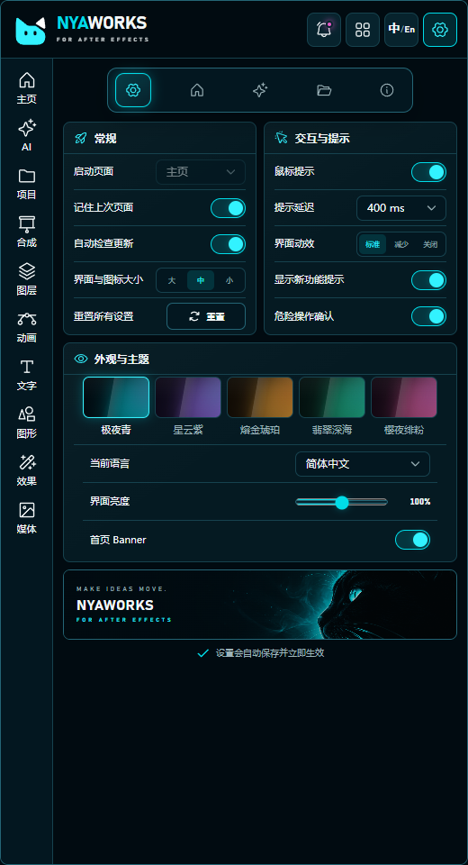
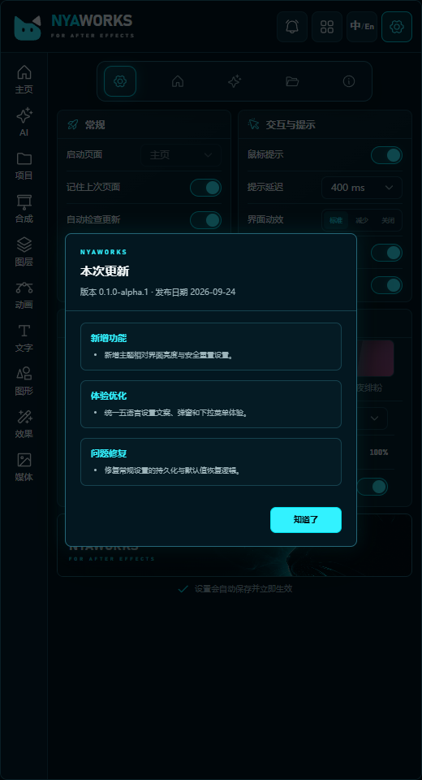
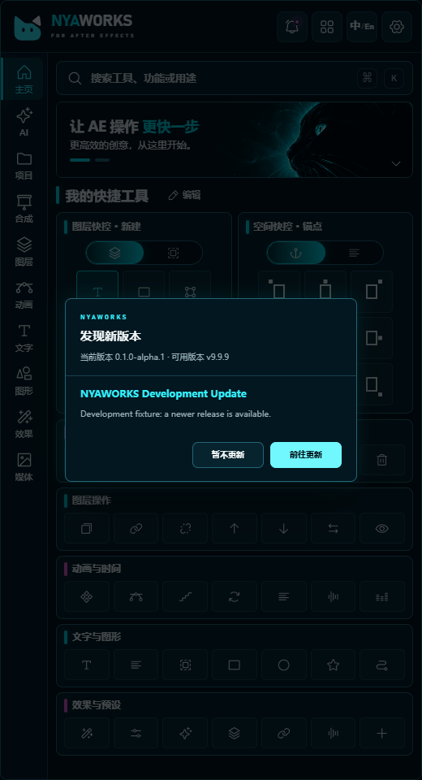
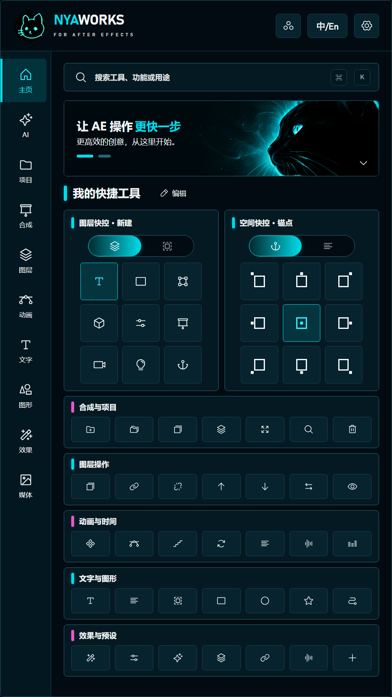

<p align="center">
  
</p>

<h1 align="center">NYAWORKS / 喵创</h1>

<p align="center">为 Adobe After Effects 打造的高频创作工具合集。</p>

## 当前状态

版本：`0.1.0-alpha.1`

NYAWORKS 已完成第一阶段 CEP 工程壳层、五套暗色主题、五语言切换、首页视觉骨架和设置中心基础。主题、语言与常规设置均可即时生效并保留用户选择；常规设置现已包含界面亮度、安全重置、新功能提示和 GitHub Release 更新检查。首页中的搜索、切换九宫格和高频工具目前为功能占位，后续将逐项接入 AE 能力。

## 主题

- 极夜青（默认）
- 星云紫
- 熔金琥珀
- 翡翠深海
- 樱夜绯粉

## 语言

- 简体中文（默认）
- 繁體中文
- English
- 日本語
- 한국어

语言按钮左键只在简体中文与 English 之间快速切换，右键打开五语言紧凑选择菜单；选择繁體中文、日本語、한국어时，按钮分别显示单字符 `繁`、`あ`、`한`。处于这三种语言时左键会先返回简体中文。

## 开发路线

- [x] M0：CEP 工程初始化
- [x] M1：五套主题切换与偏好持久化
- [x] M2：简体中文、繁体中文、英文、日文、韩文
- [x] M3：首页布局与快捷工具框架（布局编辑与预设流程已完成，AE 功能待实现）
- [ ] M4：功能页和 AE 宿主能力

## 当前界面

- 默认 CEP 窗口为 `520 × 960`，以“中”档界面密度启动。
- 右上角设置按钮进入独立设置页，设置分类为：常规、首页、AI、资源、关于。
- 常规页已接入自定义启动页面、“大 / 中 / 小”界面密度、记住上次页面、自动检查更新、首页 Banner、鼠标提示与延迟、界面动效、新功能提示、危险操作确认和重置所有设置。
- 常规设置页当前视觉与交互已确认：界面密度分类框采用随档位递减的统一圆角，界面亮度使用无原生白边、两端完整的主题色自绘滑杆。
- 关闭“记住上次页面”时，扩展会按启动页面下拉菜单的选择打开；开启时优先恢复上次停留页面。
- 界面亮度以当前主题为基准，在 `90%–110%` 之间调整，默认 `100%`；五套主题的颜色 token 不会被改写。
- “重置所有设置”恢复默认主题、简体中文、中等密度和常规偏好，并返回首页；不会删除用户资源或未来的 API Key。
- 设置页的启动页面、提示延迟和当前语言已统一使用 NYAWORKS 自定义下拉组件，后续同类控件继续复用该样式。
- 内置“创作通用”是受保护布局，默认在首页显示 5 个工具组，每组固定 7 个工具位。
- 首页“编辑”可直达布局编辑器；自定义布局支持新建、复制、重命名和删除，内置布局首次修改时先复制为自定义布局。
- 自定义工具组支持新建、复制、重命名、修改图标、排序、显隐和删除；组内 7 个工具位支持添加、替换、移除和排序。
- 首页布局支持导入、导出 NYAWORKS JSON 预设和恢复默认；预设仅包含单个首页布局，不包含主题、语言、API Key 等其他设置。
- 九宫格支持默认模式与上次模式记忆；工具执行、外部脚本和资源绑定仍按功能开发进度分阶段接入。
- 关于页已展示真实版本、扩展标识、更新渠道、本地数据状态与 GitHub 仓库入口；购买与授权、帮助与支持、诊断与信息采用独立全宽模块，避免不同内容量的卡片强制等高。
- 飞书使用文档、问题反馈表单和版本更新记录草稿已放入 `docs/feishu/`；“使用文档”和“问题反馈”均已接入对应飞书地址。
- AI、资源设置页当前为明确占位，不伪装为已完成功能。
- 首页结构不随密度改变；只调整顶栏、侧栏、间距、九宫格与工具按钮尺寸。
- 当前五种语言均已在默认窗口中检查，无横向或纵向溢出。

## 更新与新功能提示

- 顶部铃铛按钮始终保留；启用“显示新功能提示”且当前版本尚未读时显示提示点。
- 打开“本次更新”窗口会记录当前版本为已读；关闭提示设置不会删除已读记录，也不会移除铃铛入口。
- “自动检查更新”默认开启。扩展启动时会请求 GitHub Releases 的最新发布信息；网络失败、限流、无 Release 或响应异常时保持静默，不影响面板使用。
- 检测到更高版本后显示更新窗口。“暂不更新”只关闭本次提示，下次启动仍会继续提醒，直到安装新版本或关闭自动检查。
- 当前第一阶段只会打开安全的 GitHub Release 下载页，不会在扩展内自动下载或安装。自动安装保留为后续功能。

<p align="center">
  
  
</p>

<p align="center">
  
</p>

<p align="center">
  
</p>

## 发布策略

当前仓库处于早期开发阶段，暂未提供安装包。达到可用里程碑后，将通过 GitHub Releases 发布 Windows 安装包或 CEP 扩展包。

当前验证覆盖浏览器交互、TypeScript、自动化测试、生产构建和 `dist` 冒烟检查。真实 After Effects CEP 宿主中的加载、网络权限、系统浏览器跳转和长时间运行仍需单独验收，浏览器通过不等于 AE 宿主验收通过。

## 项目结构

```text
NYAWORKS/
├─ planning/       已确认的产品规划和视觉参考
├─ public/CSXS/    CEP 扩展清单
├─ public/host/    After Effects ExtendScript 宿主层
├─ src/            React 面板源码
├─ tests/          自动化测试
└─ docs/           项目文档与截图
```
