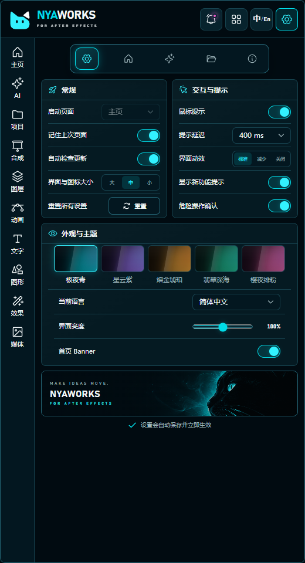
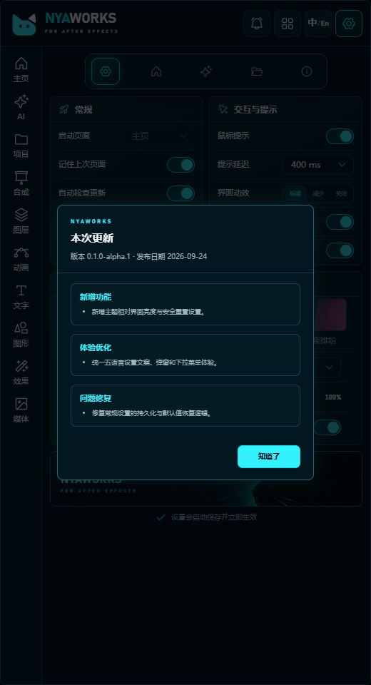
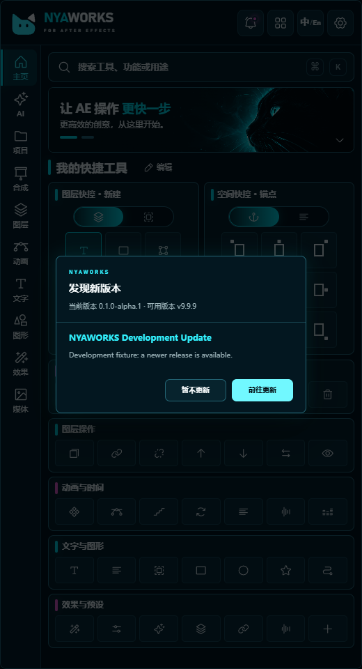
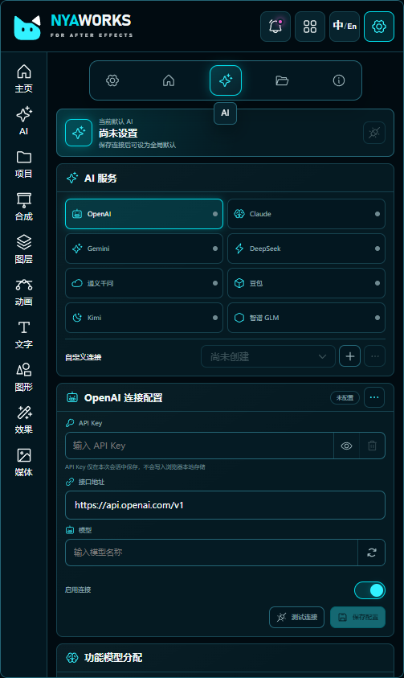
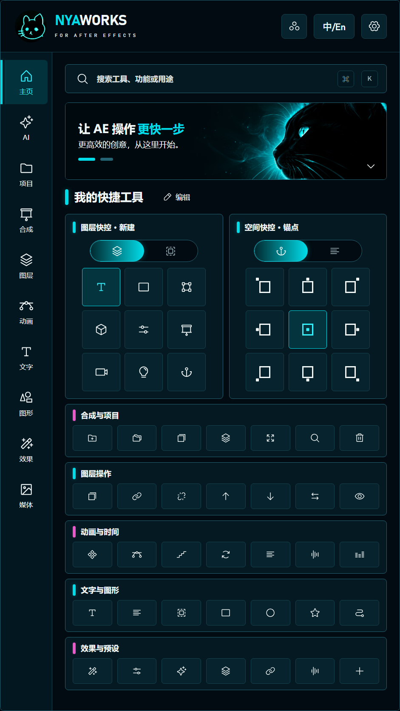

<p align="center">
  
</p>

<h1 align="center">NYAWORKS / 喵创</h1>

<p align="center">为 Adobe After Effects 打造的高频创作工具合集。</p>

## 当前状态

版本：`0.1.0-alpha.1`

NYAWORKS 已完成第一阶段 CEP 工程壳层、五套暗色主题、五语言切换、首页视觉骨架和设置中心基础。主题、语言与常规设置均可即时生效并保留用户选择；常规设置现已包含界面亮度、安全重置、新功能提示和 GitHub Release 更新检查。锚点与对齐两套九宫格已迁移到共享 Action 架构，首页与全局搜索统一经过 Registry、实时 AE Context、Runner、固定命令 Executor 和 Host Bridge 执行。锚点基础场景已完成真实 AE 验收，关键帧与表达式高级支持留待后续；图层对齐的 2D、父级与 3D 场景已完成真实 AE 2025 验收，下排三个段落对齐动作待真实 AE 验收。Nya Pie 已完成 CEP P0 调用链验证，并生成 Windows `NyaLauncher` P1 候选版，用于补齐 AE 前台判断、鼠标坐标、无边框窗口和显示器定位；正式 Pie UI 与 Pie Editor 尚未开始。Windows CEP 开发模式已支持固定扩展目录、自动 watch 构建和面板内刷新。

## 主题

- 极夜青（默认）
- 星云紫
- 熔金琥珀
- 翡翠深海
- 樱夜绯粉

## 语言

- 简体中文（默认）
- 繁體中文
- English
- 日本語
- 한국어

语言按钮左键只在简体中文与 English 之间快速切换，右键打开五语言紧凑选择菜单；选择繁體中文、日本語、한국어时，按钮分别显示单字符 `繁`、`あ`、`한`。处于这三种语言时左键会先返回简体中文。

## 开发路线

- [x] M0：CEP 工程初始化
- [x] M1：五套主题切换与偏好持久化
- [x] M2：简体中文、繁体中文、英文、日文、韩文
- [x] M3：首页布局与快捷工具框架（布局编辑与预设流程已完成，AE 功能待实现）
- [x] M3.1：CEP 开发模式（固定扩展目录、junction、watch 构建和开发面板刷新）
- [ ] M4：功能页和 AE 宿主能力（锚点与图层对齐已完成 AE 验收；段落对齐待验收；其他宿主动作待实现）
- [ ] P0：Nya Pie Runtime 调用链（第二 Modeless Extension、AE 快捷键直接呼出、KeyUp 执行、关闭和焦点返回已验证；鼠标位置、无边框窗口定位与环境矩阵待后续验证）
- [ ] P1：NyaLauncher Windows 候选版（原生自动测试、测试窗口集成和构建已完成；真实 AE 五面板、DPI、双屏、边缘、焦点和延迟验收待执行）

当前开发主线调整为 NYAWORKS 核心工具：依次完成锚点、对齐、新建、选择四套九宫格和第一批高价值增强工具。Nya Pie 保留现有技术底座，达到 20–30 个稳定 Action 后再恢复正式 Runtime 与 Editor 开发。详细路线见 [`planning/05-core-tools-priority-roadmap.md`](planning/05-core-tools-priority-roadmap.md)。

## 本地 CEP 开发模式

首次在 Windows 配置一次：

```powershell
npm run setup:cep
```

之后启动：

```powershell
npm run dev:cep
```

源码会持续构建到 `dev-extension/`，`%APPDATA%\Adobe\CEP\extensions\com.kuroii.nyaworks.panel` 通过 junction 指向该目录。前端代码修改后，在 AE 面板中点击开发刷新按钮即可测试，不需要复制扩展目录或重启 AE；Host JSX 修改建议关闭并重新打开面板，manifest、扩展 ID 或权限修改仍需要重启 AE。完整说明见 [`docs/testing/cep-development-mode.md`](docs/testing/cep-development-mode.md)。

## 当前界面

- 默认 CEP 窗口为 `520 × 960`，以“中”档界面密度启动。
- 顶部操作按钮已按三档密度进一步紧凑化；左侧导航仅显示功能图标，并保留右侧 Tooltip 与无障碍名称。
- 右上角设置按钮进入独立设置页，设置分类为：常规、首页、AI、资源、关于。
- 常规页已接入自定义启动页面、“大 / 中 / 小”界面密度、记住上次页面、自动检查更新、首页 Banner、鼠标提示与延迟、界面动效、新功能提示、危险操作确认和重置所有设置。
- 常规设置页当前视觉与交互已确认：界面密度分类框采用随档位递减的统一圆角，界面亮度使用无原生白边、两端完整的主题色自绘滑杆。
- 关闭“记住上次页面”时，扩展会按启动页面下拉菜单的选择打开；开启时优先恢复上次停留页面。
- 界面亮度以当前主题为基准，在 `90%–110%` 之间调整，默认 `100%`；五套主题的颜色 token 不会被改写。
- “重置所有设置”恢复默认主题、简体中文、中等密度和常规偏好，并返回首页；不会删除用户资源或未来的 API Key。
- 设置页的启动页面、提示延迟和当前语言已统一使用 NYAWORKS 自定义下拉组件，后续同类控件继续复用该样式。
- 内置“创作通用”默认在首页显示 5 个工具组；每组固定 8 个工具位，初始为 7 个工具加 1 个“＋”入口。编辑内置布局时，修改作为内置布局覆盖单独保存，标题保持“创作通用”。
- 首页“编辑”直接进入原地编辑态，不会创建新布局；设置页仍可独立新建、复制、重命名和删除自定义布局。旧版自动生成的默认布局副本会迁移回内置布局，并保留已有工具排列。
- 首页编辑态中，组内 8 个工具位支持拖拽排序、跨组移动、通过“＋”添加工具，以及右键替换或移除；删除或移出工具后，其余工具自动前移，空位集中在末尾，满 8 个工具的目标组会拒绝继续放入。工具组的高级新建、图标、显隐和排序仍在设置页管理。
- 工具与工具组排序已改为 Pointer Events 拖拽：包含拖拽浮层、原位占位、目标高亮、边缘自动滚动、Esc 取消和归位动画；工具组只能从六点手柄开始拖动。
- 首页布局支持导入、导出 NYAWORKS JSON 预设和恢复默认；预设仅包含单个首页布局，不包含主题、语言、API Key 等其他设置。
- 首页布局下拉框支持长名称省略且箭头固定靠右；布局、工具组和工具位操作菜单会根据窗口空间自动向上或向下展开，避免被卡片或面板边界裁切。
- 九宫格支持默认模式与上次模式记忆；锚点和对齐均注册为独立 Action，首页和全局搜索共用同一个 Action Service，并在每次执行前读取当前 AE 合成与选层状态。对齐采用智能目标：单选默认合成，多选默认选区；多选时按住 Alt/Option 或 Shift 强制对齐合成。未开启 3D 开关时走 2D 边界逻辑；开启 3D 开关时按当前相机投影边界反算 Position X/Y 并保持 Z，支持普通 3D 与带 3D 父级图层。下排 3 个文字段落动作不使用目标模式。Host 仍会二次校验并通过一个 Undo Group 完成修改。
- 首页全局搜索支持 `Ctrl/⌘ + K`、五语言名称与方向匹配、分组结果、单击选中、双击或 Enter 执行；九个锚点 Action 与九个对齐 Action 均由 Registry 直接生成搜索项，不维护第二份数据。结果浮层绝对定位，不推动 Banner 和下方九宫格。
- Banner 默认显示品牌内容；右键可选择轻量工具工作区，工具状态可恢复默认 Banner，不增加第二套九宫格，也不显示无功能的分页条或箭头。
- 新建/选择与锚点/对齐九宫格均采用双层错峰切换：图标和按钮卡片框同步淡入与回弹；锚点、对齐使用统一尺寸的自绘 SVG 图标，其中对齐以 AE 式基准线表达九种组合方向。
- 侧栏导航提示会贴在对应图标右侧并垂直居中；其他控件仍使用下方居中提示。
- 关于页已展示真实版本、扩展标识、更新渠道、本地数据状态与 GitHub 仓库入口；购买与授权、帮助与支持、诊断与信息采用独立全宽模块，避免不同内容量的卡片强制等高。
- 飞书使用文档、问题反馈表单和版本更新记录草稿已放入 `docs/feishu/`；“使用文档”和“问题反馈”均已接入对应飞书地址。
- AI 设置页支持 OpenAI、Claude、Gemini、DeepSeek、通义千问、豆包、Kimi、智谱 GLM 八个内置平台，以及多个自定义 OpenAI Compatible 连接。
- 模型字段既可以手动填写，也可以在填写 API Key 和接口地址后刷新平台模型列表；测试连接与保存配置互相独立。
- 可以设置一个全局默认模型，并让普通对话、表达式和脚本分别继承或覆盖该默认模型。
- 自定义连接支持新建、重命名、复制、启停和删除；切换连接或设置分类时，未保存修改会要求保存、放弃或取消。
- AI 生成偏好包含创意程度、输出长度、流式输出、请求超时和失败重试；数据与隐私区包含对话历史、AE 环境信息及清理入口。
- 浏览器预览中的 API Key 只保存在当前会话内，不写入 `localStorage`、布局预设、日志、诊断信息或 URL。正式 CEP 的系统安全存储和真实平台联网仍需在 AE 宿主中单独接入与验收。
- 资源设置页已支持当前运行 AE 的内置来源与手动添加的自定义来源：可更新索引、查看状态和缓存数量，并管理自定义来源的编辑、启停和移除。自动发现只针对当前打开面板所连接的 AE 版本；其他 AE 目录只能由用户手动添加，不会跨版本自动合并。
- 左侧“资源”位于“媒体”下方，提供本地资源的搜索、类型/来源/文件夹筛选、收藏和静态封面卡片。资源目录树使用紧凑字号并固定在可视区，右侧脚本列表独立滚动；没有封面的本地资源保持为清晰列表，不伪造动态图预览。
- 浏览器预览使用模拟资源和效果数据，自动化测试已覆盖缓存、来源状态、全局搜索和 Banner 状态流；真实 AE 中的目录发现、扫描、文件夹选择及脚本/预设/效果执行仍需单独宿主验收。表达式写入、临时预览渲染、云端目录与多版本自动发现均未实现。
- 首页结构不随密度改变；只调整顶栏、侧栏、间距、九宫格与工具按钮尺寸。
- AI 设置页已检查五套主题、五种语言、中/小密度、最小宽度、长连接名和长模型名；页面允许纵向滚动，不产生横向溢出。
- Nya Pie P0 新增第二 CEP Modeless Extension `com.kuroii.nyaworks.nyapie.p0`，只显示 A/B/C/D 四向探针，并通过共享 Action Runner 调用 Host 测试动作。它用于验证快捷键、KeyUp、鼠标坐标、浮窗定位和焦点恢复，不是正式 Nya Pie UI。
- P0 自动化只能验证 Action Registry、方向判断、Runtime 状态机、manifest、多入口构建和 Host Bridge。真实 AE 验收步骤见 [`docs/testing/nya-pie-p0-ae-test.md`](docs/testing/nya-pie-p0-ae-test.md)。
- NyaLauncher P1 使用隐藏的 Windows C# 进程观察 `Alt + Space`，只负责 AE 前台判断、鼠标坐标、CEP Runtime HWND 校验、去边框、定位和诊断日志；不承载 Pie UI、Action Registry 或 AE 工具逻辑。
- P1 候选程序通过 `scripts/build-nya-launcher.ps1` 生成到被 Git 忽略的 `outputs/nya-launcher-p1/NyaLauncher.exe`。自动测试与真实 AE 验收边界见 [`docs/testing/nya-launcher-p1-ae-test.md`](docs/testing/nya-launcher-p1-ae-test.md)。

## 更新与新功能提示

- 顶部铃铛按钮始终保留；启用“显示新功能提示”且当前版本尚未读时显示提示点。
- 打开“本次更新”窗口会记录当前版本为已读；关闭提示设置不会删除已读记录，也不会移除铃铛入口。
- “自动检查更新”默认开启。扩展启动时会请求 GitHub Releases 的最新发布信息；网络失败、限流、无 Release 或响应异常时保持静默，不影响面板使用。
- 检测到更高版本后显示更新窗口。“暂不更新”只关闭本次提示，下次启动仍会继续提醒，直到安装新版本或关闭自动检查。
- 当前第一阶段只会打开安全的 GitHub Release 下载页，不会在扩展内自动下载或安装。自动安装保留为后续功能。

<p align="center">
  
  
</p>

<p align="center">
  
</p>

<p align="center">
  
</p>

<p align="center">
  
</p>

<p align="center">
  
  
</p>

## 发布策略

当前仓库处于早期开发阶段。日常功能开发统一构建到 `dev-extension/`，并通过固定 junction 作为唯一 NYAWORKS 开发扩展测试，不再为每个功能生成独立测试包。`release/` 中已有目录仅作为历史阶段快照保留；只有阶段性发布、外部交付或需要保留可复现版本时才新增候选包。

当前验证覆盖浏览器交互、TypeScript、自动化测试、生产构建和 `dist` 冒烟检查。对齐功能直接在当前 NYAWORKS 开发扩展中验收；单选/多选智能目标、Alt/Shift 强制合成、2D/3D、父级、关键帧、表达式、文字段落、全局搜索和不同 AE 版本仍需单独记录，浏览器通过不等于 AE 宿主验收通过。

## 项目结构

```text
NYAWORKS/
├─ planning/       已确认的产品规划和视觉参考
├─ public/CSXS/    CEP 扩展清单
├─ public/host/    After Effects ExtendScript 宿主层
├─ src/            React 面板源码
├─ scripts/        CEP 开发配置、链接和 watch 启动脚本
├─ tests/          自动化测试
└─ docs/           项目文档与截图
```
