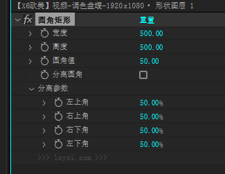

# 圆角矩形效果控件参考

来源：用户于 2026-10-08 提供的玄如意实际 AE 效果控件截图，并说明“分离参数”可以点击收起、展开。



原图未经修改，SHA-256：`5C76A0BD7AB45F699F83F62AA2E6D86B9253858345AC57CC72990C5F80A3FBB5`。

## 已核对的布局

```text
圆角矩形
  宽度                 500.00
  高度                 500.00
  圆角值                50.00
  分离圆角             □
  ▾ 分离参数
      左上角            50.00%
      右上角            50.00%
      右下角            50.00%
      左下角            50.00%
```

- 宽度、高度、圆角值和分离圆角是效果下的直接子项，不另套“尺寸”或“圆角”分组。
- 只有四角参数放进名为“分离参数”的可折叠组，顺序为左上、右上、右下、左下。
- 用户明确确认该组可以收起/展开；截图中分离圆角未勾选，组仍处于展开状态。
- 四角显示百分比。以上数字是截图当前显示值，不凭截图断言它们都是玄如意出厂默认值。
- NYAWORKS 沿用参数组织方式，使用自己的效果命名与实现，不复制参考底部的网站署名。

## NYAWORKS 行为要求

- “分离圆角”复选框决定是否启用四角独立控制。
- “分离参数”的折叠箭头只控制该组的显示；展开/收起不切换分离模式，不修改参数、关键帧或形状。
- 不把折叠箭头做成另一个复选框，不通过关闭分离圆角自动隐藏整组，也不额外增加面板按钮。
- “分离参数”展开时不增设第二层四角分组。

## 截图不能证明的部分

百分比相对的是总体圆角值、矩形尺寸还是其他归一化范围，截图无法说明；因此不能直接将 `50%` 当成 `50 px`，也不能未经核验就定义为“圆角值乘 0.5”。

在确定分离模式的表达式前，应对比四角 `0 / 50 / 100%`、不同宽高以及不同总体圆角值的几何结果，同时核对百分比控件的实际存储值和允许范围。该验证只影响新伪效果的参数换算；现有原生控件工程保持原状。

参考截图已足够确定布局与折叠交互，不需要再次向用户索取同一张图。实际参数索引、折叠表现、关键帧及百分比换算仍需分别验收。

### 2026-10-08 百分比实测

在独立的 Windows AE 2025 `25.6x101` 测试工程中，通过本机已安装玄如意的公开 API `xuanruyi.layer.create("shape")` 创建参考对象；只采集参数值与几何，不复制其表达式源码。测量后恢复测试对象的原始参数。

参考实际效果 matchName 为 `Pseudo/loyoi-W80gulg9`。四角属性编号为 `6 / 7 / 8 / 9`，显示单位为“百分比”，默认读取值均为 `50`。分离分组为第 `5` 项。这些只描述参考对象，不用作 NYAWORKS 的正式模板映射。

| 输入宽高 | 总圆角 | 四角百分比 | 路径实际宽高 | 实际四角半径 |
| --- | --- | --- | --- | --- |
| 500 × 500 | 50 | 全 0% | 250 × 250 | 全 0 |
| 500 × 500 | 50 | 全 50% | 250 × 250 | 全 62.5 |
| 500 × 500 | 50 | 全 100% | 250 × 250 | 全 125 |
| 1000 × 500 | 50 | 全 50% | 500 × 250 | 全 62.5 |
| 500 × 1000 | 50 | 全 50% | 250 × 500 | 全 62.5 |
| 500 × 500 | 10 | 全 50% | 250 × 250 | 全 62.5 |
| 500 × 500 | 100 | 全 50% | 250 × 250 | 全 62.5 |
| 500 × 500 | 50 | 10 / 20 / 30 / 40% | 250 × 250 | 12.5 / 25 / 37.5 / 50 |

以上均为分离模式。基于这些独立样本可确定：四角按**路径实际短边的一半 × 百分比 / 100**换算；分离开启后，总圆角不参与四角换算。参考默认宽高输入与实际路径宽高存在二倍差异，不把这一行为复制到 NYAWORKS。

NYAWORKS 仍需保持原有真实 `500 × 500`、非分离圆角 `50 px`。对应此尺寸的四角 `50%` 应为 `125 px`，而不是 `50 px`。若希望首次打开分离开关时外观不跳变，四角初值应采用 `20%`；这是待正式制作源固定时的产品选择，不修改旧工程。

当前已验证上述样本的百分比换算；有效范围边界及 UI 展开/收起的点击验收尚未由本轮自动化完成。
